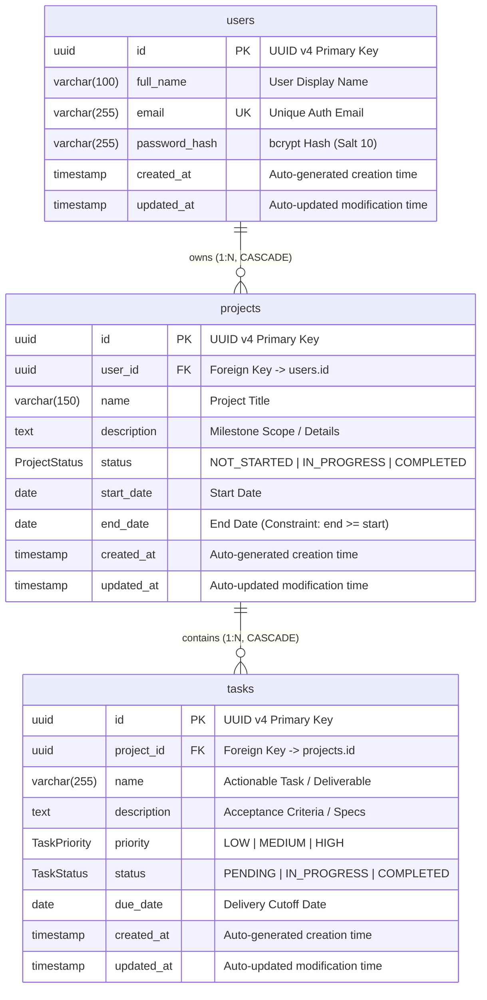

# ProjectFlow Enterprise Suite — Database Schema & Entity Relationship (ER) Diagram

This document contains the complete database architecture, entity relationships, data dictionary, indexing strategy, and full SQL DDL specifications for the **ProjectFlow Enterprise Suite**.

---

## 1. Visual Entity Relationship (ER) Diagram



---

## 2. Text Representation / Cardinality Map

```
  +-------------------------------------------------------------+
  |                            users                            |
  +-------------------------------------------------------------+
  | PK  id:            UUID / VARCHAR(36)                       |
  |     full_name:     VARCHAR(100) NOT NULL                    |
  | UQ  email:         VARCHAR(255) NOT NULL UNIQUE             |
  |     password_hash: VARCHAR(255) NOT NULL                    |
  |     created_at:    TIMESTAMP DEFAULT NOW()                  |
  |     updated_at:    TIMESTAMP DEFAULT NOW()                  |
  +-------------------------------------------------------------+
                               |
                               | 1:N Relationship
                               | (ON DELETE CASCADE, ON UPDATE CASCADE)
                               v
  +-------------------------------------------------------------+
  |                          projects                           |
  +-------------------------------------------------------------+
  | PK  id:            UUID / VARCHAR(36)                       |
  | FK  user_id:       UUID / VARCHAR(36) -> users(id)          |
  |     name:          VARCHAR(150) NOT NULL                    |
  |     description:   TEXT NULL                                |
  |     status:        ENUM('NOT_STARTED',                      |
  |                         'IN_PROGRESS',                      |
  |                         'COMPLETED') DEFAULT 'IN_PROGRESS'  |
  |     start_date:    DATE NOT NULL                            |
  |     end_date:      DATE NOT NULL (end_date >= start_date)   |
  |     created_at:    TIMESTAMP DEFAULT NOW()                  |
  |     updated_at:    TIMESTAMP DEFAULT NOW()                  |
  +-------------------------------------------------------------+
                               |
                               | 1:N Relationship
                               | (ON DELETE CASCADE, ON UPDATE CASCADE)
                               v
  +-------------------------------------------------------------+
  |                            tasks                            |
  +-------------------------------------------------------------+
  | PK  id:            UUID / VARCHAR(36)                       |
  | FK  project_id:    UUID / VARCHAR(36) -> projects(id)       |
  |     name:          VARCHAR(255) NOT NULL                    |
  |     description:   TEXT NULL                                |
  |     priority:      ENUM('LOW', 'MEDIUM', 'HIGH')            |
  |                    DEFAULT 'MEDIUM'                         |
  |     status:        ENUM('PENDING', 'IN_PROGRESS',           |
  |                         'COMPLETED') DEFAULT 'PENDING'      |
  |     due_date:      DATE NOT NULL                            |
  |     created_at:    TIMESTAMP DEFAULT NOW()                  |
  |     updated_at:    TIMESTAMP DEFAULT NOW()                  |
  +-------------------------------------------------------------+
```

---

## 3. Data Dictionary & Field Specifications

### 3.1 `users` Table
Stores registered authenticated enterprise users.

| Column | Data Type | Nullable | Default | Constraints | Description |
| :--- | :--- | :--- | :--- | :--- | :--- |
| `id` | `VARCHAR(36)` / `UUID` | No | `uuid()` | `PRIMARY KEY` | Globally unique user identifier |
| `full_name` | `VARCHAR(100)` | No | None | None | User's full display name |
| `email` | `VARCHAR(255)` | No | None | `UNIQUE INDEX` | Primary user credential & login ID |
| `password_hash` | `VARCHAR(255)` | No | None | None | Salted bcrypt hash (`bcryptjs`) |
| `created_at` | `TIMESTAMP(3)` | No | `CURRENT_TIMESTAMP` | None | Account creation audit timestamp |
| `updated_at` | `TIMESTAMP(3)` | No | `CURRENT_TIMESTAMP` | None | Last profile update timestamp |

### 3.2 `projects` Table
Represents high-level business initiatives, products, or epics owned by an authenticated user.

| Column | Data Type | Nullable | Default | Constraints | Description |
| :--- | :--- | :--- | :--- | :--- | :--- |
| `id` | `VARCHAR(36)` / `UUID` | No | `uuid()` | `PRIMARY KEY` | Unique project identifier |
| `user_id` | `VARCHAR(36)` / `UUID` | No | None | `FOREIGN KEY -> users(id)` | Multi-tenant ownership identifier |
| `name` | `VARCHAR(150)` | No | None | None | Title of the corporate project |
| `description` | `TEXT` | Yes | `NULL` | None | Detailed scope and requirements |
| `status` | `ENUM` | No | `'IN_PROGRESS'` | Enforced Enum | State: `NOT_STARTED`, `IN_PROGRESS`, `COMPLETED` |
| `start_date` | `DATE` | No | None | None | Project start timeline |
| `end_date` | `DATE` | No | None | `end_date >= start_date` | Scheduled delivery milestone date |
| `created_at` | `TIMESTAMP(3)` | No | `CURRENT_TIMESTAMP` | None | Project creation audit timestamp |
| `updated_at` | `TIMESTAMP(3)` | No | `CURRENT_TIMESTAMP` | None | Last project update timestamp |

### 3.3 `tasks` Table
Represents granular deliverables, action items, or Kanban cards assigned to a parent project.

| Column | Data Type | Nullable | Default | Constraints | Description |
| :--- | :--- | :--- | :--- | :--- | :--- |
| `id` | `VARCHAR(36)` / `UUID` | No | `uuid()` | `PRIMARY KEY` | Unique deliverable identifier |
| `project_id` | `VARCHAR(36)` / `UUID` | No | None | `FOREIGN KEY -> projects(id)` | Associated parent project container |
| `name` | `VARCHAR(255)` | No | None | None | Actionable deliverable title |
| `description` | `TEXT` | Yes | `NULL` | None | Detailed specifications & acceptance criteria |
| `priority` | `ENUM` | No | `'MEDIUM'` | Enforced Enum | Priority level: `LOW`, `MEDIUM`, `HIGH` |
| `status` | `ENUM` | No | `'PENDING'` | Enforced Enum | Lifecycle state: `PENDING`, `IN_PROGRESS`, `COMPLETED` |
| `due_date` | `DATE` | No | None | None | Target deliverable completion date |
| `created_at` | `TIMESTAMP(3)` | No | `CURRENT_TIMESTAMP` | None | Task creation audit timestamp |
| `updated_at` | `TIMESTAMP(3)` | No | `CURRENT_TIMESTAMP` | None | Last task modification timestamp |

---

## 4. Indexing Strategy & Performance Optimization

To guarantee sub-10ms response times for high-volume enterprise operations, the following indexes are defined:

| Index Name | Table | Columns | Index Type | Purpose |
| :--- | :--- | :--- | :--- | :--- |
| `users_email_key` | `users` | `email` | `BTREE (UNIQUE)` | Constant-time `O(1)` authentication lookup |
| `projects_user_id_idx` | `projects` | `user_id` | `BTREE` | Fast retrieval of user-scoped projects |
| `projects_status_idx` | `projects` | `status` | `BTREE` | High-efficiency filtering by project status |
| `tasks_project_id_idx` | `tasks` | `project_id` | `BTREE` | Instant fetch of all deliverables for a project |
| `tasks_status_idx` | `tasks` | `status` | `BTREE` | Kanban column sorting & KPI dashboard count |
| `tasks_priority_idx` | `tasks` | `priority` | `BTREE` | High/Medium/Low priority triage filtering |

---

## 5. Referential Integrity & Business Rules

1. **Cascading Project Deletion**:
   - `projects` records reference `users(id)` with `ON DELETE CASCADE`.
   - Deleting a user cleans up all associated projects.
2. **Cascading Task Deletion (Zero Orphan Guarantee)**:
   - `tasks` records reference `projects(id)` with `ON DELETE CASCADE`.
   - Deleting a project permanently deletes all associated tasks in a single atomic transaction.
3. **Multi-Tenant Ownership Isolation**:
   - Every API request validates that `project.user_id === authenticated_user_id`.
   - Direct access to foreign user resources returns HTTP `404 Not Found` or `403 Forbidden`.
4. **Chronological Integrity**:
   - Application-layer validators (`projectValidator.js`) and database constraints enforce `end_date >= start_date`.

---

## 6. Full Production SQL DDL (PostgreSQL / Supabase)

```sql
-- 1. Create Enums
CREATE TYPE "ProjectStatus" AS ENUM ('NOT_STARTED', 'IN_PROGRESS', 'COMPLETED');
CREATE TYPE "TaskPriority" AS ENUM ('LOW', 'MEDIUM', 'HIGH');
CREATE TYPE "TaskStatus" AS ENUM ('PENDING', 'IN_PROGRESS', 'COMPLETED');

-- 2. Create Users Table
CREATE TABLE "users" (
    "id" VARCHAR(36) NOT NULL DEFAULT gen_random_uuid()::text,
    "full_name" VARCHAR(100) NOT NULL,
    "email" VARCHAR(255) NOT NULL,
    "password_hash" VARCHAR(255) NOT NULL,
    "created_at" TIMESTAMP(3) NOT NULL DEFAULT CURRENT_TIMESTAMP,
    "updated_at" TIMESTAMP(3) NOT NULL DEFAULT CURRENT_TIMESTAMP,

    CONSTRAINT "users_pkey" PRIMARY KEY ("id")
);

-- Unique Index for Auth Lookups
CREATE UNIQUE INDEX "users_email_key" ON "users"("email");

-- 3. Create Projects Table
CREATE TABLE "projects" (
    "id" VARCHAR(36) NOT NULL DEFAULT gen_random_uuid()::text,
    "user_id" VARCHAR(36) NOT NULL,
    "name" VARCHAR(150) NOT NULL,
    "description" TEXT,
    "status" "ProjectStatus" NOT NULL DEFAULT 'IN_PROGRESS',
    "start_date" DATE NOT NULL,
    "end_date" DATE NOT NULL,
    "created_at" TIMESTAMP(3) NOT NULL DEFAULT CURRENT_TIMESTAMP,
    "updated_at" TIMESTAMP(3) NOT NULL DEFAULT CURRENT_TIMESTAMP,

    CONSTRAINT "projects_pkey" PRIMARY KEY ("id"),
    CONSTRAINT "projects_user_id_fkey" FOREIGN KEY ("user_id") 
        REFERENCES "users"("id") ON DELETE CASCADE ON UPDATE CASCADE
);

-- Performance Indexes on Projects
CREATE INDEX "projects_user_id_idx" ON "projects"("user_id");
CREATE INDEX "projects_status_idx" ON "projects"("status");

-- 4. Create Tasks Table
CREATE TABLE "tasks" (
    "id" VARCHAR(36) NOT NULL DEFAULT gen_random_uuid()::text,
    "project_id" VARCHAR(36) NOT NULL,
    "name" VARCHAR(255) NOT NULL,
    "description" TEXT,
    "priority" "TaskPriority" NOT NULL DEFAULT 'MEDIUM',
    "status" "TaskStatus" NOT NULL DEFAULT 'PENDING',
    "due_date" DATE NOT NULL,
    "created_at" TIMESTAMP(3) NOT NULL DEFAULT CURRENT_TIMESTAMP,
    "updated_at" TIMESTAMP(3) NOT NULL DEFAULT CURRENT_TIMESTAMP,

    CONSTRAINT "tasks_pkey" PRIMARY KEY ("id"),
    CONSTRAINT "tasks_project_id_fkey" FOREIGN KEY ("project_id") 
        REFERENCES "projects"("id") ON DELETE CASCADE ON UPDATE CASCADE
);

-- Performance Indexes on Tasks
CREATE INDEX "tasks_project_id_idx" ON "tasks"("project_id");
CREATE INDEX "tasks_status_idx" ON "tasks"("status");
CREATE INDEX "tasks_priority_idx" ON "tasks"("priority");
```

---

## 7. Prisma Schema Specification (`schema.prisma`)

```prisma
generator client {
  provider = "prisma-client-js"
}

datasource db {
  provider = "postgresql"
  url      = env("DATABASE_URL")
}

enum ProjectStatus {
  NOT_STARTED
  IN_PROGRESS
  COMPLETED
}

enum TaskPriority {
  LOW
  MEDIUM
  HIGH
}

enum TaskStatus {
  PENDING
  IN_PROGRESS
  COMPLETED
}

model User {
  id           String    @id @default(uuid())
  fullName     String    @map("full_name") @db.VarChar(100)
  email        String    @unique @db.VarChar(255)
  passwordHash String    @map("password_hash") @db.VarChar(255)
  createdAt    DateTime  @default(now()) @map("created_at")
  updatedAt    DateTime  @updatedAt @map("updated_at")

  projects     Project[]

  @@map("users")
}

model Project {
  id          String        @id @default(uuid())
  userId      String        @map("user_id")
  name        String        @db.VarChar(150)
  description String?       @db.Text
  status      ProjectStatus @default(IN_PROGRESS)
  startDate   DateTime      @map("start_date") @db.Date
  endDate     DateTime      @map("end_date") @db.Date
  createdAt   DateTime      @default(now()) @map("created_at")
  updatedAt   DateTime      @updatedAt @map("updated_at")

  user        User          @relation(fields: [userId], references: [id], onDelete: Cascade)
  tasks       Task[]

  @@index([userId])
  @@index([status])
  @@map("projects")
}

model Task {
  id          String       @id @default(uuid())
  projectId   String       @map("project_id")
  name        String       @db.VarChar(255)
  description String?      @db.Text
  priority    TaskPriority @default(MEDIUM)
  status      TaskStatus   @default(PENDING)
  dueDate     DateTime     @map("due_date") @db.Date
  createdAt   DateTime     @default(now()) @map("created_at")
  updatedAt   DateTime     @updatedAt @map("updated_at")

  project     Project      @relation(fields: [projectId], references: [id], onDelete: Cascade)

  @@index([projectId])
  @@index([status])
  @@index([priority])
  @@map("tasks")
}
```
